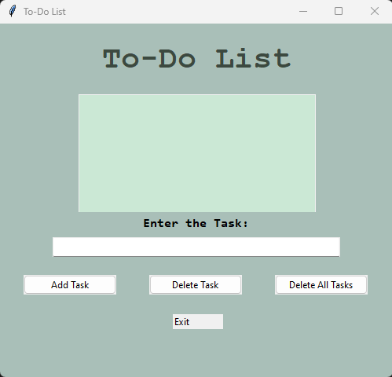

# Python To Do List GUI

This is a simple to-do list app created using Tkinter in Python. It allows users to add, remove, and complete all tasks.
## Features
- Add and remove tasks.
- Clear all tasks.

## Technology Stack
- Programming Language: Python
- SQL Lite
- Graphical User Interface (GUI) Toolkit: Tkinter

## How to Run

1. Clone the repository to your local machine.
2. Open a terminal window and navigate to the project directory.
3. Run the Calculator Application using the following command:

```bash
  python app.py
```
## Demo

Here is the link of the demo video:
[LinkedIn Post](https://www.linkedin.com/feed/update/urn:li:activity:7139855415562960896/)


## Screenshot



